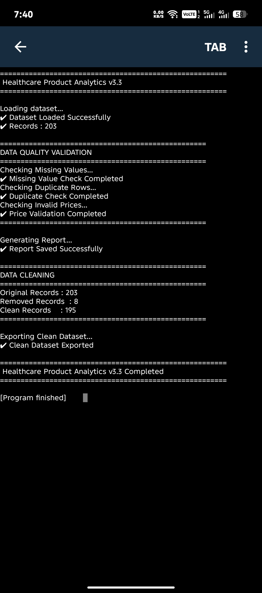
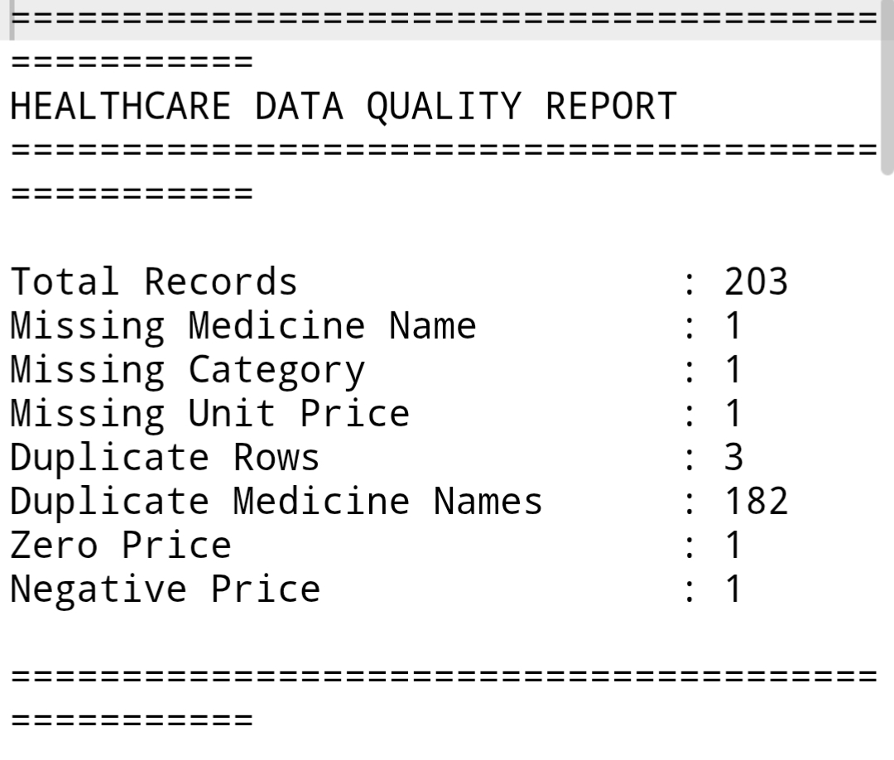
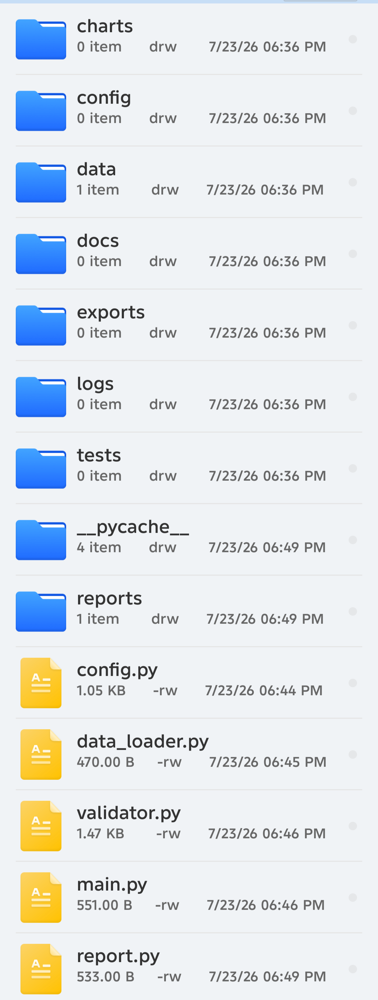

# 🏥 Healthcare Product Analytics

## 📌 Overview

Healthcare Product Analytics is a Python-based data analytics project designed to analyze medicine datasets, generate business insights, validate data quality, and visualize trends.

This project demonstrates real-world data analysis techniques used by Data Analysts and Business Analysts.

---

## 🚀 Features

- Load medicine dataset from CSV
- Data quality validation
- Missing value detection
- Duplicate row detection
- Invalid price detection
- Automatic quality report generation
- Data cleaning pipeline
- Export cleaned dataset
- Modular Python architecture

## 🛠 Technologies

- Python
- Pandas
- Matplotlib
- CSV
- Git
- GitHub

---

Healthcare_Product_Analytics/
│
├── main.py
├── config.py
├── data_loader.py
├── validator.py
├── report.py
│
├── data/
│   ├── medicine_data.csv
│   └── clean_medicine_data.csv
│
├── reports/
│   └── quality_report.txt
│
├── charts/
├── exports/
├── docs/
├── logs/
├── tests/
└── config/

Sample Output (v3.3)

## 🎯 Future Versions

- Exploratory Data Analysis (v3.4)
- Advanced Visualizations
- Excel Export
- SQLite Database
- Power BI Dashboard
- Machine Learning
- Streamlit Dashboard

---

## 👨‍💻 Author

**Pushpendu Chakraborty**

GitHub: https://github.com/Pnc-Tech/Healthcare-Product-Analytics

---
## 💻 Console Output

## 📊 Data Quality Report

## 📁 Project Structure

