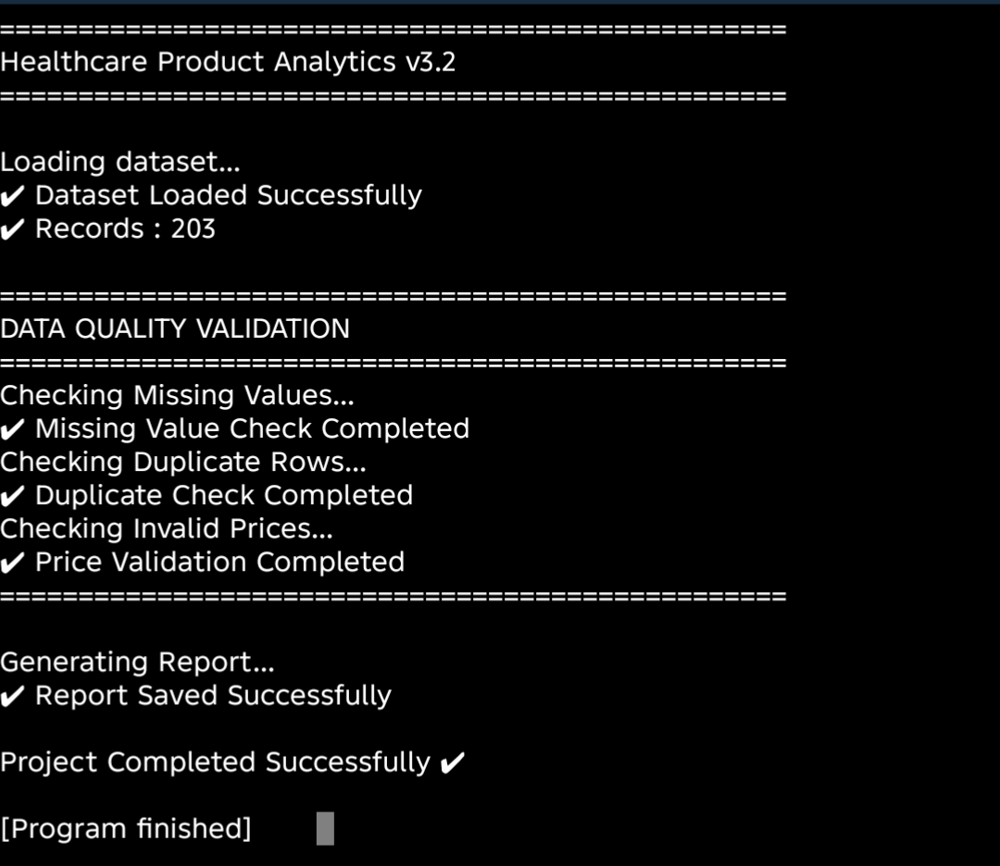

# 🏥 Healthcare Product Analytics

## 📌 Overview

Healthcare Product Analytics is a Python-based data analytics project designed to analyze medicine datasets, generate business insights, validate data quality, and visualize trends.

This project demonstrates real-world data analysis techniques used by Data Analysts and Business Analysts.

---

## 🚀 Features

- Load medicine dataset from CSV
- Data validation
- Missing value detection
- Duplicate detection
- Statistical analysis
- Category-wise analysis
- Business insights
- Bar chart visualization
- Pie chart visualization
- Automatic chart saving

---

## 🛠 Technologies

- Python
- Pandas
- Matplotlib
- CSV
- Git
- GitHub

---

## 📁 Project Structure

```text
Healthcare_Product_Analytics/
│
├── main.py
├── data/
├── charts/
├── reports/
├── exports/
└── README.md
```

---

## 📊 Sample Output

- Dataset Preview
- Summary Statistics
- Category Analysis
- Business Insights
- Professional Charts

---

## 🎯 Future Versions

- Data Cleaning
- Excel Export
- SQLite Database
- Power BI Dashboard
- Machine Learning
- Streamlit Dashboard

---

## 👨‍💻 Author

**Pushpendu Chakraborty**

GitHub: https://github.com/Pnc-Tech/Healthcare-Product-Analytics

---
## 💻 Console Output



## 📊 Data Quality Report


## 📁 Project Structure

